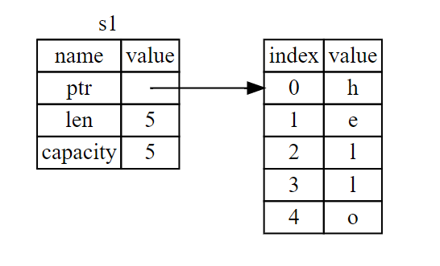
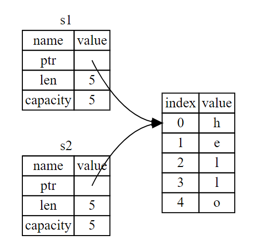
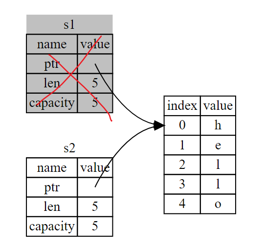
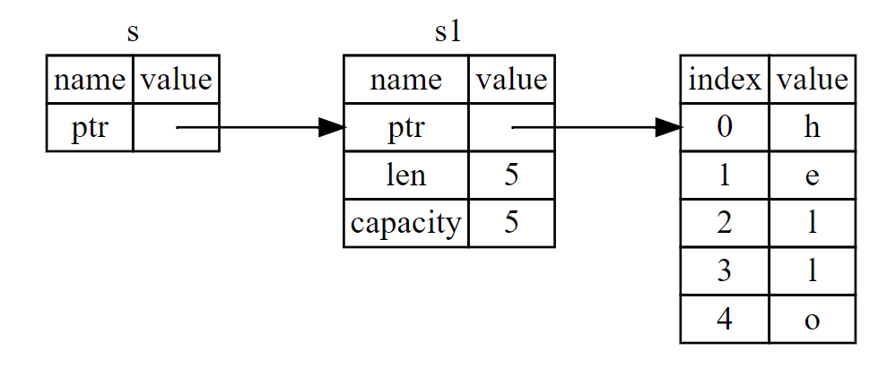
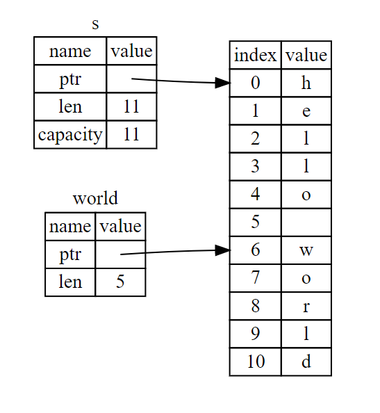

# 第一部分

## 一. 使用

### 1. Cargo编译加运行

Cargo有点像Java中的Maven与Ant的合体，是一个依赖管理工具，不过更全能一些，用来管理依赖，编译，运行等。

```text
$ cargo new hello_cargo    // 创建项目
$ cd hello_cargo           // 切换到项目路径下
```

路径下一般会有一个`src`文件夹，一个`Cargo.toml`文件，以及版本控制`.gitignore`文件。

```text
$ cargo build              // 编译并生成可执行文件
$ cargo check              // 编译，不生成可执行文件（快）
```

生成的可执行文件一般在`./target/debug/`下，用`cargo build`命令时由于会生成可执行文件，所以速度比`cargo check`慢一点。

```text
$ cargo run                // build并执行项目文件
```

## 二. 最简单的程序：Hello World

```text
fn main() {
    println!("Hello World!");
}
```

这部分与C语言类似，必须从main函数开始，fn相当于Python的def，用来标记一个函数，区别是不需要头文件。println不是一个函数，而是一个宏规则，所以函数名后面要加！。常见的输出方式有print!\(\)，println!\(\)。

## 三. 通用编程概念

### 1. 变量与可变性

```text
fn main(){
    let a = 123;     // 声明一个不可变变量，类型自动判断，这点和Python类似
    a = 234;         // 此语法错误，因为a不可变
    let a = a + 1;   // 语法正确，称之为重影(Shadowing)，也就是说重新绑定

    let mut a = 123; // 声明一个可变变量
    a = 234;         // 语法正确
    a = "abc";       // 语法错误，因为a已经被认定为了整型数据，不能被赋予字符串
    a++;             // 语法错误，Rust无++，--

    let a: u64 = 123;   // Rust也可以指定数据类型，只需要在变量名后面指定数据类型的名字

    const a: i32 = 123; // 注意：不可变变量不是常量，不可变变量可以重影，常量不行，常量后面的数据类型必须标注
}
```

注意：已声明的变量不用的话，编译会出现warning的。

### 2. 数据类型

#### 1\). 标量\(Scalar\)

* **整型**：有符号整型：`i8`, `i16`, `i32`, `i64`, `i128`，默认为`i32`。无符号整型：`u8`, `u16`, `u32`, `u64`, `u128`。此外还有`arch`的`isize`和`usize`，他们的所用字节数是根据你们电脑系统来定的，64位机器就是64位，32位机器就是32位。
* **浮点型**：32位浮点数：`f32`，64位浮点数：`f64`，默认`f64`。
* **布尔型**：布尔型用 `bool` 表示，值只能为 `true` 或 `false`。
* **字符型**：字符型用 `char` 表示，`char` 类型大小为 4 个字节，代表 Unicode标量值。

  **2\). 组合类型\(Compound\)**

* **元组**：用一对`()`包括的一组数据，可以包含不同种类的数据

  ```text
  fn main(){
    let tup: (i32, f64, u8) = (500, 6.4, 1);
    let tup2 = (500, 6.4, "hello");
    let (x, y, z) = (1, 2, 3);      // 解构let

    let x = tup.0;
    let y = tup.1;
    let z = tup.2;

    println!("x is {}", x);
  }
  ```

* **数组**：用一对`[]`包括的同类型数据

  ```text
  fn main(){
    let a = [1, 2, 3, 4, 5];
    let b: [i32;5] = [1, 2, 3, 4, 5];
    let c = [0; 20];             // c的每个元素都初始化为0

    println!("a[0] is {}", a[0]);

    println!("b has {} elements", b.len());
  }
  ```

### 3. 函数

```rust
fn main() {
    println!("Hello, world!");
    println!("res is {}", function(2, 3));
}

fn function(x: i32, y: i32) -> i32 {
    return x + y;
}
```

function\(\)的声明放在main\(\)函数的前面或者后面都行, 参数一定要标明数据类型，若有返回值就要添加`->`并在其后标明数据类型，而且在函数结尾要有`return`，没有就不需要`->`和`return`。

```rust
fn main() {
    fn five() -> i32 {
        5   
    }
    println!("five() 的值为: {}", five());
}
```

函数还可以嵌套。函数显式返回用`return`，也可以隐式返回最后一个表达式\(不加分号的那种\)的值。

此外，Rust 中可以在一个用`{}`包括的块里编写一个较为复杂的表达式，这种表达式块叫做函数体表达式。Rust语句不返回值，C等中的语句会返回值。

```text
fn main() {
    let x = 5;

    let y = {
        let x = 3;
        x + 1       // 最后一个表达式无分号，如果有分号的话就会变成一个语句，不返回值了
    };              // 表达式的结尾有分号

    println!("x 的值为 : {}", x);
    println!("y 的值为 : {}", y);
}
```

函数指针：

```text
let x: fn(i32) -> i32 = foo;
```

### 4. 控制流

#### 1\). if语句

```rust
fn main() {
    let a = 12;
    let b;
    if a > 0 {
        b = 1;
    }  
    else if a < 0 {
        b = -1;
    }  
    else {
        b = 0;
    };
    println!("b is {}", b);
}
```

注意：Rust 中的 if 不存在单语句不用加 `{}` 的规则，不允许使用一个语句代替一个块。条件表达式必须是 `bool` 类型。

```text
fn main() {
    let a = 3;
    let number = if a > 0 { 1 } else { -1 };  // 高级用法
    println!("number is {}", number);
}
```

注意：两个花括号中的类型必须一样！且必须有一个 else 及其后的表达式块，要整型都整型，要函数都函数。

#### 3\). while循环: 与C语言差不多

```text
fn main() {
    let mut number = 1;
    while number != 4 {
        println!("{}", number);
        number += 1;
    }
    println!("end while");
}
```

#### 4\). for循环：在 C 语言中 for 循环使用三元语句控制循环，但是 Rust 中**没有**这种用法，for语句用于遍历一个迭代器。

```text
fn main() {
    let mut a = [10, 20, 30, 40, 50];
    for i in a.iter() {             // 创造一个不可修改值的循环器
        println!("value is {}", i);
    }

    for i in a.iter_mut() {         // 创造一个可修改值的循环器
        println!("value is {}", i);
    }

    for i in 0..10 {                 // 左闭右开
        println!("value is {}", i);
    }

    for i in 0...10 {                // 左闭右闭
        println!("value is {}", i);
    }

    for (index, value) in (5..10).enumerate() {    // 记录循环了多少次了
        println!("index = {} and value = {}", index, value);
    }
}
```

循环标签:

```rust
'outer: for x in 0..10 {
    'inner: for y in 0..10 {
        if x % 2 == 0 { continue 'outer; } // Continues the loop over `x`.
        if y % 2 == 0 { continue 'inner; } // Continues the loop over `y`.
        println!("x: {}, y: {}", x, y);
    }
}
```

#### 5\). loop循环：Rust 语言有原生的无限循环结构

```rust
fn main() {
    let s = ['A', 'B', 'C', 'D', 'E', 'F'];
    let mut i = 0;
    loop {
        let ch = s[i];
        if ch == 'D' {
            break;
        }
        println!("No.{} is {}", i, ch);
        i += 1;
    }
}
```

## 四. 理解所有权

### 1. 所有权

Rust 的核心功能（之一）是 所有权（ownership）。虽然该功能很容易解释，但它对语言的其他部分有着深刻的影响。所有权（系统）是 Rust 最为与众不同的特性，它让 Rust 无需垃圾回收（garbage collector）即可保障内存安全。

#### 1\). 栈和堆

1. **栈**中的所有数据都必须占用已知且固定的大小。栈上的数据会自动的移入移出。
2. 在编译时大小未知或大小可能变化的数据，要改为存储在**堆**上。堆是缺乏组织的：当向堆放入数据时，你要请求一定大小的空间。操作系统在堆的某处找到一块足够大的空位，把它标记为已使用，并返回一个表示该位置地址的 指针（pointer）。这个过程称作 在堆上分配内存（allocating on the heap），有时简称为 “分配”（allocating）。将数据推入栈中并不被认为是分配。因为指针的大小是已知并且固定的，你可以将指针存储在栈上，不过当需要实际数据时，必须访问指针。
3. 访问堆上的数据比访问栈上的数据慢，因为必须通过指针来访问。现代处理器在内存中跳转越少就越快（缓存）。
4. 跟踪哪部分代码正在使用堆上的哪些数据，最大限度的减少堆上的重复数据的数量，以及清理堆上不再使用的数据确保不会耗尽空间，这些问题正是所有权系统要处理的。

#### 2\). 所有权规则

所有权有以下三条规则：

* Rust 中的每个值都有一个变量，称为其所有者。
* 一次只能有一个所有者。
* 当所有者不在程序运行范围时，该值将被删除。

#### 3\). 变量作用域：

与C语言类似，用一个例子表示

```rust
{
    // 在声明以前，变量 s 无效
    let s = "Hello";
    // 这里是变量 s 的可用范围
}
// 变量范围已经结束，变量 s 无效
```

#### 4\). `String`类型

String类型比前面介绍的基本数据类型要更复杂，有助于帮我们理解所有权机制。**String是存储在堆中的**。我们已经见过字符串字面值，字符串值被硬编码进程序里。字符串字面值是很方便的，不过他们并不适合使用文本的每一种场景。原因之一就是他们是不可变的。另一个原因是并不是所有字符串的值都能在编写代码时就知道：例如，要是想获取用户输入并存储该怎么办呢？为此，Rust 有第二个字符串类型，String。这个类型被分配到堆上，所以能够存储在编译时未知大小的文本。可以使用 from 函数基于字符串字面值来创建 String，如下：

```rust
let s1 = String::from("Hello");
let mut s2 = String::from("hello");

s2.push_str(", world!");     // 其后追加

println!("{}", s2);
```

为什么 `String` 可变而字面值却不行呢？区别在于两个类型对内存的处理上。

#### 5\). 内存和分配:

就字符串字面值来说，我们在编译时就知道其内容，所以文本被直接硬编码进最终的可执行文件中。这使得字符串字面值快速且高效。不过这些特性都只得益于字符串字面值的不可变性。不幸的是，我们不能为了每一个在编译时大小未知的文本而将一块内存放入二进制文件中，并且它的大小还可能随着程序运行而改变。

对于 `String` 类型，为了支持一个可变，可增长的文本片段，需要在堆上分配一块在编译时未知大小的内存来存放内容。这意味着：

* 必须在运行时向操作系统请求内存。
* 需要一个当我们处理完 `String` 时将内存返回给操作系统的方法。

第一部分由我们完成：当调用 `String::from` 时，它的实现 \(implementation\) 请求其所需的内存。这在编程语言中是非常通用的。

然而，第二部分实现起来就各有区别了。在有**垃圾回收**（garbage collector，GC）的语言中， GC 记录并清除不再使用的内存，而我们并不需要关心它。没有 GC 的话，识别出不再使用的内存并调用代码显式释放就是我们的责任了，跟请求内存的时候一样。从历史的角度上说正确处理内存回收曾经是一个困难的编程问题。如果忘记回收了会浪费内存。如果过早回收了，将会出现无效变量。如果重复回收，这也是个 bug。我们需要精确的为一个 `allocate` 配对一个 `free`。

Rust 采取了一个不同的策略：内存在拥有它的变量离开作用域后就被自动释放。下面是使用 `String` 的版本：

```rust
{
    let s = String::from("hello"); // 从此处起，s 是有效的

    // 使用 s
}                                  // 此作用域已结束，
                                   // s 不再有效
```

这是一个将 `String` 需要的内存返回给操作系统的很自然的位置：当 `s` 离开作用域的时候。

当变量离开作用域，Rust 为我们调用一个特殊的函数。这个函数叫做 `drop`，在这里 `String` 的作者可以放置释放内存的代码。Rust 在结尾的 `}` 处自动调用 `drop`。

#### 4\). 变量与数据交互的方式（一）：移动

Rust 中的多个变量可以采用一种独特的方式与同一数据交互。

```rust
let x = 5;
let y = x;
```

我们大致可以猜到这在干什么：“将 5 绑定到 x；接着生成一个值 x 的拷贝并绑定到 y”。现在有了两个变量，x 和 y，都等于 5。这也正是事实上发生了的，因为整数是有已知固定大小的简单值，所以这两个 5 被放入了栈中。

下面看看 `String` 版本：

```rust
let s1 = String::from("hello");
let s2 = s1;
```

这看起来与上面的代码非常类似，所以我们可能会假设他们的运行方式也是类似的：也就是说，第二行可能会生成一个 s1 的拷贝并绑定到 s2 上。不过，事实上并不完全是这样。

`String` 由三部分组成，如图左侧所示：一个指向存放字符串内容内存的指针，一个长度，和一个容量。这一组数据存储在栈上。右侧则是堆上存放内容的内存部分。



长度表示 `String` 的内容当前使用了多少字节的内存。容量是 `String` 从操作系统总共获取了多少字节的内存。长度与容量的区别是很重要的，不过在当前上下文中并不重要，所以现在可以忽略容量。

当我们将 `s1` 赋值给 `s2`，`String` 的数据被复制了，这意味着我们从栈上拷贝了它的指针、长度和容量。我们并没有复制指针指向的堆上数据。换句话说，内存中数据的表现如下图所示。



之前我们提到过当变量离开作用域后，Rust 自动调用 `drop` 函数并清理变量的堆内存。不过第二张图展示了两个数据指针指向了同一位置。这就有了一个问题：当 `s2` 和 `s1` 离开作用域，他们都会尝试释放相同的内存。这是一个叫做二次释放（double free）的错误，也是之前提到过的内存安全性 bug 之一。两次释放（相同）内存会导致内存污染，它可能会导致潜在的安全漏洞。

为了确保内存安全，这种场景下 Rust 的处理有另一个细节值得注意。与其尝试拷贝被分配的内存，Rust 则认为 `s1` 不再有效，因此 Rust 不需要在 `s1` 离开作用域后清理任何东西。

```rust
let s1 = String::from("hello");
let s2 = s1; 
println!("{}, world!", s1); // 错误！s1 已经失效
```

如果你在其他语言中听说过术语**浅拷贝**（shallow copy）和**深拷贝**（deep copy），那么拷贝指针、长度和容量而不拷贝数据可能听起来像浅拷贝。不过因为 Rust 同时使第一个变量无效了，这个操作被称为 **移动**（move），而不是浅拷贝。上面的例子可以解读为 `s1` 被**移动**到了 `s2` 中。那么具体发生了什么，如下图所示。



另外，这里还隐含了一个设计选择：Rust 永远也不会自动创建数据的 “深拷贝”。因此，任何 **自动** 的复制可以被认为对运行时性能影响较小。

#### 5\). 变量与数据交互的方式（二）：克隆

如果我们 确实 需要深度复制 String 中堆上的数据，而不仅仅是栈上的数据，可以使用一个叫做 `clone` 的通用函数。

```rust
let s1 = String::from("hello");
let s2 = s1.clone();

println!("s1 = {}, s2 = {}", s1, s2);
```

#### 6\). 只在栈上的数据：拷贝

```rust
let x = 5;
let y = x;

println!("x = {}, y = {}", x, y);
```

像整型这样的在编译时已知大小的类型被整个存储在栈上，所以拷贝其实际的值是快速的。这意味着没有理由在创建变量 `y` 后使 `x` 无效。换句话说，这里没有深浅拷贝的区别，所以这里调用 `clone` 并不会与通常的浅拷贝有什么不同，我们可以不用管它。

Rust 有一个叫做 `Copy` trait 的特殊注解，可以用在类似整型这样的存储在栈上的类型上（第十章详细讲解 trait）。如果一个类型拥有 `Copy` trait，一个旧的变量在将其赋值给其他变量后仍然可用。Rust 不允许自身或其任何部分实现了 `Drop` trait 的类型使用 `Copy` trait。如果我们对其值离开作用域时需要特殊处理的类型使用 `Copy` 注解，将会出现一个编译时错误。（**这里我的理解是：存储在堆上的数据类型才有`Drop`，实现了 `Drop` 的肯定是堆上的数据**）

那么什么类型是 `Copy` 的呢？可以查看给定类型的文档来确认，不过作为一个通用的规则，任何简单标量值的组合可以是 `Copy` 的，不需要分配内存或某种形式资源的类型是 `Copy` 的。如下是一些 `Copy` 的类型：

* 所有整数类型，例如 `i32` 、 `u32` 、 `i64` 等。
* 布尔类型 `bool`，值为 `true` 或 `false` 。
* 所有浮点类型，`f32` 和 `f64`。
* 字符类型 `char`。
* 仅包含以上类型数据的元组（`Tuples`）。

#### 5\). 函数的所有权机制

将值传递给函数在语义上与给变量赋值相似。向函数传递值可能会移动或者复制，就像赋值语句一样。

```rust
fn main() {
    let s = String::from("hello");  // s 进入作用域

    takes_ownership(s);             // s 的值移动到函数里 ...
                                    // ... 所以到这里不再有效

    let x = 5;                      // x 进入作用域

    makes_copy(x);                  // x 应该移动函数里，
                                    // 但 i32 是 Copy 的，所以在后面可继续使用 x

} // 这里, x 先移出了作用域，然后是 s。但因为 s 的值已被移走，
  // 所以不会有特殊操作

fn takes_ownership(some_string: String) { // some_string 进入作用域
    println!("{}", some_string);
} // 这里，some_string 移出作用域并调用 `drop` 方法。占用的内存被释放

fn makes_copy(some_integer: i32) { // some_integer 进入作用域
    println!("{}", some_integer);
} // 这里，some_integer 移出作用域。不会有特殊操作
```

如果将变量当作参数传入函数，那么它和移动的效果是一样的。

#### 6\). 返回值与函数

返回值也可以转移所有权。

```rust
fn main() {
    let s1 = gives_ownership();         // gives_ownership 将返回值移给 s1

    let s2 = String::from("hello");     // s2 进入作用域

    let s3 = takes_and_gives_back(s2);  // s2 被移动到takes_and_gives_back 中, 它也将返回值移给 s3

} // 这里, s3 移出作用域并被丢弃。s2 也移出作用域，但已被移走，
  // 所以什么也不会发生。s1 移出作用域并被丢弃

fn gives_ownership() -> String {             // gives_ownership 将返回值移动给调用它的函数

    let some_string = String::from("hello"); // some_string 进入作用域.

    some_string                              // 返回 some_string 并移出给调用的函数
}

// takes_and_gives_back 将传入字符串并返回该值
fn takes_and_gives_back(a_string: String) -> String { // a_string 进入作用域

    a_string  // 返回 a_string 并移出给调用的函数
}
```

变量的所有权总是遵循相同的模式：将值赋给另一个变量时移动它。当持有堆中数据值的变量离开作用域时，其值将通过 drop 被清理掉，除非数据被移动为另一个变量所有。

### 2. 引用\(References\)与租借\(Borrowing\)

举例：我们想写一个计算`String`长度的函数，我们不能这么写，因为我们还想继续使用 `s1` ：

```rust
fn main() {
    let s1 = String::from("hello");

    let len = calculate_length(s1);

    println!("The length of '{}' is {}.", s1, len);  // s1失效了
}

fn calculate_length(s: String) -> usize {
    s.len()
}
```

下面是如何定义并使用一个（新的）`calculate_length` 函数，它以一个对象的引用作为参数而不是获取值的所有权：

```rust
fn main() {
    let s1 = String::from("hello");

    let len = calculate_length(&s1);

    println!("The length of '{}' is {}.", s1, len);
}

fn calculate_length(s: &String) -> usize {
    s.len()
}
```

这些 `&` 符号就是**引用**，它们允许你使用值但不获取其所有权。下图展示了一张示意图。



`&s1` 语法让我们创建一个**指向**值 `s1` 的引用，但是并不拥有它。因为并不拥有这个值，当引用离开作用域时其指向的值也不会被丢弃。

变量 `s` 有效的作用域与函数参数的作用域一样，不过当引用离开作用域后并不丢弃它指向的数据，因为我们没有所有权。当函数使用引用而不是实际值作为参数，无需返回值来交还所有权，因为就不曾拥有所有权。

我们将获取引用作为函数参数称为 **借用**（borrowing）。正如变量默认是不可变的，引用也一样。（默认）不允许修改引用的值。

在需要的时候可以使用可变引用：

```rust
fn main() {
    let mut s = String::from("hello");

    change(&mut s);
}

fn change(some_string: &mut String) {
    some_string.push_str(", world");
}
```

不过可变引用有一个很大的限制：在特定作用域中的特定数据有且只有一个可变引用。可以允许同时存在多个不可变引用，但是一次只能拥有一个可变引用。同样的，可变引用和不可变引用不可以同时存在。

注意一个引用的作用域从声明的地方开始一直持续到最后一次使用为止。例如，因为最后一次使用不可变引用在声明可变引用之前，所以如下代码是可以编译的：

```rust
let mut s = String::from("hello");

let r1 = &s; // 没问题
let r2 = &s; // 没问题
println!("{} and {}", r1, r2);
// 此位置之后 r1 和 r2 不再使用

let r3 = &mut s; // 没问题
println!("{}", r3);
```

#### \* 垂悬引用

在具有指针的语言中，很容易通过释放内存时保留指向它的指针而错误地生成一个 **悬垂指针**（dangling pointer），所谓悬垂指针是其指向的内存可能已经被分配给其它持有者。相比之下，在 Rust 中编译器确保引用**永远也不会**变成悬垂状态：当你拥有一些数据的引用，编译器确保数据不会在其引用之前离开作用域。

```rust
fn main() {
    let reference_to_nothing = dangle();
}

fn dangle() -> &String {
    let s = String::from("hello");

    &s  // 错误
}
```

因为 `s` 是在 `dangle` 函数内创建的，当 `dangle` 的代码执行完毕后，`s` 将被释放。不过我们尝试返回它的引用。这意味着这个引用会指向一个无效的 `String`，这可不对！Rust 不会允许我们这么做。

### 3. 切片类型

另一个没有所有权的数据类型是 `slice`（第一种是引用）。`slice` 允许你引用集合中一段连续的元素序列，而不用引用整个集合。

#### 1\). 字符串slice

字符串 slice（string slice）是 String 中一部分值的引用，它看起来像这样：

```rust
let s = String::from("hello world");

let hello = &s[0..5];
let world = &s[6..11];
```

`x..y` 表示 `[x, y)` 的数学含义， `..` 两边可以没有运算数。

实际使用如图： 



一个字符串被引用之后是不能再改变了的，回忆一下借用规则，当拥有某值的不可变引用时，就不能再获取一个可变引用。

#### 2\). 字符串字面值就是 slice

还记得我们讲到过字符串字面值被储存在二进制文件中吗。现在知道 slice 了，我们就可以正确的理解字符串字面值了：

```rust
let s = "Hello, world!";
```

这里 `s` 的类型是 `&str`：它是一个指向二进制程序特定位置的 `slice`。这也就是为什么字符串字面值是不可变的；`&str` 是一个不可变引用。

#### 3\). 其他类型的 slice

字符串 `slice`，正如你想象的那样，是针对字符串的。不过也有更通用的 `slice` 类型。

```rust
let a = [1, 2, 3, 4, 5];

let slice = &a[1..3];
```

#### 4\). 总结：

所有权、借用和 slice 这些概念让 Rust 程序在编译时确保内存安全。Rust 语言提供了跟其他系统编程语言相同的方式来控制你使用的内存，但拥有数据所有者在离开作用域后自动清除其数据的功能意味着你无须额外编写和调试相关的控制代码。

## 五. 结构体

结构体与C++中的类似：

### 1. 结构体的声明和使用

```rust
struct User {  // 声明
    username: String,
    email: String,
    sign_in_count: u64;
    active: bool,
}

let user1 = User{   // 初始化一个实例
    email: String::from("someone@email.com"),
    username: String::from("someusername123"),
    active: true,
    sign_in_count: 1,
};

let mut user2 = User{
    email: String::from("someone@email.com"),
    username: String::from("someusername123"),
    active: true,
    sign_in_count: 1,
};
user2.email = String::from("anotheremail@email.com");
```

如果声明了一个结构体实例user1，但是想声明另一个与user1大部分数据相同的结构体实例user2，就可以使用下面的方法：

```rust
let user2 = User{
    email:String::from("another@example.com"),
    username: String::from("anotherusername567"),
    ..user1    // 此处相当于除了上面特别声明的不一样之外，剩下的都与user1相同
};
```

### 2. 元组结构体

元组结构体的内部变量不需要名字，只有变量类型

```rust
struct Color(i32, i32, i32);
struct Point(i32, i32, i32);

let black = Color(0, 0, 0);
let origin = Point(0, 0, 0);
```

### 3. 通过派生Trait增加实用功能

当我们尝试输出结构体时，用下面的方法往往会出现错误：

```rust
struct Rectangle {
    width: u32,
    height: u32,
}

fn main() {
    let rect1 = Rectangle { width: 30, height: 50 };

    println!("rect1 is {}", rect1);
}
```

`println!`宏能处理很多类型的格式，不过，`{}` 默认告诉 `println!` 使用被称为 `Display` 的格式：意在提供给直接终端用户查看的输出。目前为止见过的基本类型都默认实现了 `Display`，因为它就是向用户展示其他任何基本类型的唯一方式。不过对于结构体，`println!` 应该用来输出的格式是不明确的，因为这有更多显示的可能性：是否需要逗号？需要打印出大括号吗？所有字段都应该显示吗？由于这种不确定性，Rust 不会尝试猜测我们的意图，所以结构体并没有提供一个 `Display` 实现。

但是我们如果在结构体定义之前加上 \#\[derive\(Debug\)\] 注解，然后使用一些特殊的格式输出\(这些均出现在错误信息中\)。

```rust
#[derive(Debug)]
struct Rectangle {
    width: u32,
    height: u32,
}

fn main() {
    let rect1 = Rectangle { width: 30, height: 50 };

    println!("rect1 is {:?}", rect1);      // 第一种格式
    println!("rect1 is {:#?}", rect1);     // 第二种格式
}
```

Rust 为我们提供了很多可以通过 `derive` 注解来使用的 `trait`，他们可以为我们的自定义类型增加实用的行为。

### 4. 方法语法

**方法**与函数类似：它们使用 `fn` 关键字和名称声明，可以拥有参数和返回值，同时包含在某处调用该方法时会执行的代码。不过方法与函数是不同的，因为它们在结构体的上下文中被定义（或者是枚举或 trait 对象的上下文），并且它们第一个参数总是 `self`，它代表调用该方法的结构体实例。

#### 1\). 定义方法

Rust 通过impl关键字提供了使用方法调用语法（method call syntax）。这样写的话有利于组织：我们将某个类型实例能做的所有事情都一起放入`impl`块中，而不是让将来的用户在我们的库中到处寻找`Rectangle`的功能。

```rust
#[derive(Debug)]
struct Rectangle {
    width: u32,
    height: u32,
}

impl Rectangle {  // impl 是 implementation 的缩写
    fn area(&self) -> u32 {
        self.width * self.height
    }
}

fn main() {
    let rect1 = Rectangle { width: 30, height: 50 };

    println!(
        "The area of the rectangle is {} square pixels.",
        rect1.area()    // 在实例上直接调用方法
    );
}
```

方法的第一参数比较特殊，`&self`。它有3种变体：`self`，`&self`和`&mut self`。方法可以选择获取`self`的所有权，或者像我们这里一样不可变地借用`self`，或者可变地借用`self`，就跟其他参数一样。这里选择`&self`的理由是：我们并不想获取所有权，只希望能够读取结构体中的数据，而不是写入。如果想要在方法中改变调用方法的实例，需要将第一个参数改为`&mut self`。

也可以把`impl`块写成多个:

```rust
impl Rectangle {
    fn area(&self) -> u32 {
        self.width * self.height
    }
}

impl Rectangle {
    fn can_hold(&self, other: &Rectangle) -> bool {
        self.width > other.width && self.height > other.height
    }
}
```

还可以链式方法调用：

```rust
struct Circle {
    x: f64,
    y: f64,
    radius: f64,
}

impl Circle {
    fn area(&self) -> f64 {
        std::f64::consts::PI * (self.radius * self.radius)
    }

    fn grow(&self, increment: f64) -> Circle {
        Circle { x: self.x, y: self.y, radius: self.radius + increment }
    }
}

fn main() {
    let c = Circle { x: 0.0, y: 0.0, radius: 2.0 };
    println!("{}", c.area());

    let d = c.grow(2.0).area();  // 链式
    println!("{}", d);
}
```

#### 2\). 关联函数

`impl`块的另一个有用的功能是：允许在`impl`块中定义 不以`self`作为参数的函数。这被称为关联函数（associated functions），因为它们与结构体相关联。它们仍是函数而不是方法，因为它们并不作用于一个结构体的实例。

```rust
impl Rectangle {
    fn square(size: u32) -> Rectangle {
        Rectangle { width: size, height: size }
    }
}
```

使用结构体名和`::`语法来调用这个关联函数：比如`let sq = Rectangle::square(3);` 。这个方法位于结构体的命名空间中：`::` 语法用于关联函数和模块创建的命名空间。这在前面我们已经用过了，比如使用 `String::from` 关联函数了

## 六. 枚举类型与模式匹配

### 1. 定义枚举

#### 1\). 定义

可以通过在代码中定义一个 IpAddrKind 枚举来表现这个概念并列出可能的 IP 地址类型，V4 和 V6。这被称为枚举的成员（variants）：

```rust
enum IpAddrKind {  // 枚举类型也是一种数据类型
    V4,
    V6,
}

let four = IpAddrKind::V4;  // 实例化
let six = IpAddrKind::V6;

fn route(ip_type: IpAddrKind) { }  // 函数参数

route(IpAddrKind::V4);  // 调用
```

现在 IpAddrKind 就是一个可以在代码中使用的自定义数据类型了。

也可以把枚举类型放在结构体中：

```rust
enum IpAddrKind {
    V4,
    V6,
}

struct IpAddr {
    kind: IpAddrKind,
    address: String,
}

let home = IpAddr {
    kind: IpAddrKind::V4,
    address: String::from("127.0.0.1"),
};

let loopback = IpAddr {
    kind: IpAddrKind::V6,
    address: String::from("::1"),
};
```

我们可以使用一种更简洁的方式来表达相同的概念，仅仅使用枚举并将数据直接放进每一个枚举成员而不是将枚举作为结构体的一部分。IpAddr 枚举的新定义表明了 V4 和 V6 成员都关联了 String 值，这样就不需要一个额外的结构体了：

```rust
// 可以放一个数据
enum IpAddr {
    V4(String),
    V6(String),
}

let home = IpAddr::V4(String::from("127.0.0.1"));

let loopback = IpAddr::V6(String::from("::1"));

// 可以放多个数据
enum IpAddr {
    V4(u8, u8, u8, u8),
    V6(String),
}

let home = IpAddr::V4(127, 0, 0, 1);

let loopback = IpAddr::V6(String::from("::1"));

// 可以放很多种数据类型
enum Message {
    Quit,
    Move { x: i32, y: i32 },
    Write(String),
    ChangeColor(i32, i32, i32),
}
```

#### 2\). 使用impl

结构体和枚举还有另一个相似点：就像可以使用 impl 来为结构体定义方法那样，也可以在枚举上定义方法。这是一个定义于我们 Message 枚举上的叫做 call 的方法：

```rust
impl Message {
    fn call(&self) {
        // 在这里定义方法体
    }
}

let m = Message::Write(String::from("hello"));
m.call();
```

方法体使用了 `self` 来获取调用方法的值。这个例子中，创建了一个值为 `Message::Write(String::from("hello"))` 的变量 m，而且这就是当 `m.call()` 运行时 `call` 方法中的 `self` 的值。

#### 3\). Option枚举

Rust 没有空值，不过它确实拥有一个可以编码存在或不存在概念的枚举。这个枚举是 Option，它在标准库中的定义如下：

```rust
enum Option<T> {
    Some(T),
    None,
}
```

你不需要将其显式引入作用域。另外，它的成员可以不需要 `Option::` 前缀来直接使用 `Some` 和 `None`。即便如此 `Option<T>` 也仍是常规的枚举，`Some(T)` 和 `None` 仍是 `Option<T>` 的成员。

`<T>`语法是一个泛型类型参数，后面会更详细的讲解泛型。目前，所有你需要知道的就是 `<T>` 意味着 `Option` 枚举的 `Some` 成员可以包含任意类型的数据。这里是一些包含数字类型和字符串类型 `Option` 值的例子：

```rust
let some_number = Some(5);
let some_string = Some("a string");

let absent_number: Option<i32> = None;
```

如果使用 `None` 而不是 `Some`，需要告诉 Rust `Option<T>` 是什么类型的，因为编译器只通过 `None` 值无法推断出 `Some` 成员保存的值的类型。

灵魂拷问，**那么，`Option<T>` 为什么就比空值要好呢？**

简而言之，考虑一个编程场景，你不知道某个值是空还是不空，你需要假设是吧，先假设它是不空的，`let x = some(5)`，当 `x` 与其他数相加减的时候，编译是会报错的，因为不是同类型的（比如`x`是`Option<T>`类型的，`y`是`i32`类型的），必须要把 `x` 显式转化成 `i32` 类型的才能运算，**相当于提个醒**，这样就解决了很多bug（虽然我也不懂这些bug是啥意思）。具体怎么转化以后用到再说吧。

### 2. match语句

#### 1\). 控制

Rust 有一个叫做 `match` 的极为强大的控制流运算符，它允许我们将一个值与一系列的模式相比较，并根据相匹配的模式执行相应代码。模式可由字面值、变量、通配符和许多其他内容构成；第十八章会涉及到所有不同种类的模式以及它们的作用。`match` 的力量来源于模式的表现力以及编译器检查，它确保了所有可能的情况都得到处理。

```rust
enum Coin {
    Penny,
    Nickel,
    Dime,
    Quarter,
}

fn value_in_cents(coin: Coin) -> u8 {
    match coin {
        Coin::Penny => 1,
        Coin::Nickel => 5,
        Coin::Dime => 10,
        Coin::Quarter => 25,
    }
}

fn value_in_cents(coin: Coin) -> u8 {
    match coin {
        Coin::Penny => {    // 分支较长的话可使用大括号
            println!("Lucky penny!");
            1
        },
        Coin::Nickel => 5,
        Coin::Dime => 10,
        Coin::Quarter => 25,
    }
}
```

#### 2\). 匹配`Option<T>`

比如我们想要编写一个函数，它获取一个 `Option<i32>` ，如果其中含有一个值，将其加一。如果其中没有值，函数应该返回 `None` 值，而不尝试执行任何操作。

```rust
fn plus_one(x: Option<i32>) -> Option<i32> {
    match x {
        None => None,
        Some(i) => Some(i + 1),   // Some(i)是一个Option<i32>类型
    }
}

let five = Some(5);        // five被固定成了一个Option<i32>类型
let six = plus_one(five);
let none = plus_one(None);
```

`Some(5)` 与 `Some(i)` 匹配吗？当然匹配！它们是相同的类型成员，`Option<i32>`。`i` 绑定了 `Some` 中包含的值，所以 `i` 的值是 `5`。接着匹配分支的代码被执行，所以我们将 `i` 的值加一并返回一个含有值 `6` 的新 `Some`。

#### 3\). 匹配是穷尽的

考虑以下 `plus_one` 函数的这个版本，它有一个 bug 并不能编译:

```rust
fn plus_one(x: Option<i32>) -> Option<i32> {
    match x {
        Some(i) => Some(i + 1),
    }
}
```

我们没有处理 None 的情况，所以这些代码会造成一个 bug。Rust 知道我们没有覆盖所有可能的情况甚至知道哪些模式被忘记了！Rust 中的匹配是 穷尽的（exhaustive）：必须穷举到最后的可能性来使代码有效。特别的在这个 `Option<T>` 的例子中，Rust 防止我们忘记明确的处理 `None` 的情况。

#### 4\). 通配符`_`

`_` 模式会匹配所有的值。通过将其放置于其他分支之后，`_` 将会匹配所有之前没有指定的可能的值。`()` 就是 unit 值，所以 `_` 的情况什么也不会发生。因此，可以说我们想要对 `_` 通配符之前没有列出的所有可能的值不做任何处理。

```rust
let some_u8_value = 0u8;
match some_u8_value {
    1 => println!("one"),
    3 => println!("three"),
    5 => println!("five"),
    7 => println!("seven"),
    _ => (),
}
```

### 3. if let 简单控制流

`match` 在只关心**一个**情况的场景中可能就有点啰嗦了。为此 Rust 提供了`if let`。`if let` 语法让我们以一种不那么冗长的方式结合 `if` 和 `let`，来处理只匹配一个模式的值而忽略其他模式的情况。考虑如下的程序，它匹配一个 `Option<u8>` 值并只希望当值为 `3` 时执行代码:

```rust
let some_u8_value = Some(0u8);
match some_u8_value {
    Some(3) => println!("three"),
    _ => (),
}
```

我们可以使用 if let 这种更短的方式编写

```rust
if let Some(3) = some_u8_value {
    println!("three");
}
```

`if let` 获取通过等号分隔的一个模式和一个表达式。它的工作方式与 `match` 相同，这里的表达式对应 `match` 而模式则对应第一个分支。可以认为 `if let` 是 `match` 的一个语法糖，它当值匹配某一模式时执行代码而忽略所有其他值。

可以在 if let 中包含一个 else。

```rust
let mut count = 0;
match coin {
    Coin::Quarter(state) => println!("State quarter from {:?}!", state),
    _ => count += 1,
}
```

可以改写成：

```rust
let mut count = 0;
if let Coin::Quarter(state) = coin {
    println!("State quarter from {:?}!", state);
} else {
    count += 1;
}
```

## 七. 包\(Packages\)，包装箱\(Crates\)与模块\(Modules\)

### 1. 包和crate

crate 是一个二进制项或者库。crate root 是一个源文件，Rust 编译器以它为起始点，并构成你的 crate 的根模块。包（package） 是提供一系列功能的一个或者多个 crate。一个包会包含有一个 `Cargo.toml` 文件，阐述如何去构建这些 crate。

#### 1\). 包的构建规则

* 一个包中至多**只能**包含一个**库 crate**\(library crate\)；
* 包中可以包含任意多个**二进制 crate**\(binary crate\)；
* 包中至少包含一个 crate，无论是库的还是二进制的。  

可以使用`cargo new`构建包

### 2. 模块

通过执行 `cargo new --lib restaurant`，来创建一个新的名为 `restaurant` 的库。然后将示例中所罗列出来的代码放入 `src/lib.rs` 中，来定义一些模块和函数。

```rust
mod front_of_house {
    mod hosting {
        fn add_to_waitlist() {}

        fn seat_at_table() {}
    }

    mod serving {
        fn take_order() {}

        fn server_order() {}

        fn take_payment() {}
    }
}
```

我们定义一个模块，是以 `mod` 关键字为起始，然后指定模块的名字（本例中叫做 front\_of\_house），并且用花括号包围模块的主体。在模块内，我们还可以定义其他的模块，就像本例中的 `hosting` 和 `serving` 模块。模块还可以保存一些定义的其他项，比如结构体、枚举、常量、特性、或者函数。

写模块的时候也要注意公有还有私有性，Rust 中默认所有项（函数、方法、结构体、枚举、模块和常量）都是私有的。父模块中的项不能使用子模块中的私有项，但是子模块中的项可以使用他们父模块中的项。可以使用`pub`关键字变成公有。

### 3. 路径用于引用模块树中的项

来看一下 Rust 如何在模块树中找到一个项的位置，我们使用路径的方式，就像在文件系统使用路径一样。如果我们想要调用一个函数，我们需要知道它的路径。

路径有两种形式：

* 绝对路径（absolute path）：从 `crate` 根开始，以 `crate` 名或者字面值 `crate` 开头。
* 相对路径（relative path）：从当前模块开始，以 `self`、`super` 或当前模块的标识符开头。

绝对路径和相对路径都后跟一个或多个由双冒号（`::`）分割的标识符。

```rust
mod front_of_house {
    mod hosting {
        fn add_to_waitlist() {}
    }
}

pub fn eat_at_restaurant() {
    // Absolute path
    crate::front_of_house::hosting::add_to_waitlist();

    // Relative path
    front_of_house::hosting::add_to_waitlist();
}
```

### 4. 使用 `use` 关键字将名称引入作用域

我们可以一次性将路径引入作用域，然后使用 use 关键字调用该路径中的项，就如同它们是本地项一样。

```rust
mod front_of_house {
    pub mod hosting {
        pub fn add_to_waitlist() {}
    }
}

use crate::front_of_house::hosting;

pub fn eat_at_restaurant() {
    hosting::add_to_waitlist();
    hosting::add_to_waitlist();
    hosting::add_to_waitlist();
}
```

还可以使用`as`关键字提供新的名称

```rust
use std::fmt::Result;
use std::io::Result as IoResult;

fn function1() -> Result {
    // --snip--
}

fn function2() -> IoResult<()> {
    // --snip--
}
```

## 八. 常见集合

集合可以包含多个值。不同于内建的数组和元组类型，这些集合指向的数据是储存在堆上的，这意味着数据的数量不必在编译时就已知，并且还可以随着程序的运行增长或缩小。

### 1. vector

`Vec` 是一个由标准库提供的类型，它可以存放任何类型，而当 `Vec` 存放某个特定类型时，那个类型位于尖括号中。在更实际的代码中，一旦插入值 Rust 就可以推断出想要存放的类型，所以你很少会需要这些类型注解。更常见的做法是使用初始值来创建一个 `Vec`，而且为了方便 Rust 提供了 `vec!` 宏。

```rust
// 常见声明方式
let v: Vec<i32> = Vec::new();
let v = vec![1, 2, 3];

// 往后面添加元素
let mut v = Vec::new();
v.push(5);    // 根据添加的数据类型推断出vec的类型
v.push(6);
```

vector的访问方式有两种：

```rust
let v = vec![1, 2, 3, 4, 5];

let third: &i32 = &v[2];
println!("The third element is {}", third);

match v.get(2) {
    Some(third) => println!("The third element is {}", third),
    None => println!("There is no third element."),
}
```

这两个不同的获取第三个元素的方式分别为：使用`&` 和 `[]` 返回一个引用；或者使用 `get` 方法以索引作为参数来返回一个 `Option<&T>`。当读取的下标超出范围时，对于第一个`[]`方法，当引用一个不存在的元素时 Rust 会造成`panic`。这个方法更适合当程序认为尝试访问超过`vector`结尾的元素是一个严重错误的情况，这时应该使程序崩溃。当`get`方法被传递了一个数组外的索引时，它不会`panic`而是返回`None`。当偶尔出现超过`vector`范围的访问属于正常情况的时候可以考虑使用它。

遍历一个`vector`:

```rust
let v = vec![100, 32, 57];
for i in &v {
    println!("{}", i);
}

let mut v = vec![100, 32, 57];
for i in &mut v {
    *i += 50;     // * 号是解引用运算符
}
```

vector 只能储存相同类型的值。这是很不方便的；绝对会有需要储存一系列不同类型的值的用例。幸运的是，枚举的成员都被定义为相同的枚举类型，所以当需要在 vector 中储存不同类型值时，我们可以定义并使用一个枚举：

```rust
enum SpreadsheetCell {
    Int(i32),
    Float(f64),
    Text(String),
}

let row = vec![
    SpreadsheetCell::Int(3),
    SpreadsheetCell::Text(String::from("blue")),
    SpreadsheetCell::Float(10.12),
];          // 初始化一个vector
```

### 2. 字符串

Rust 的核心语言中只有一种字符串类型：`str`，字符串 `slice`，它通常以被借用的形式出现，`&str`。前面讲到了 字符串 `slice`：它们是一些储存在别处的 UTF-8 编码字符串数据的引用。比如字符串字面值被储存在程序的二进制输出中，字符串 `slice` 也是如此。

称作 `String` 的类型是由标准库提供的，而没有写进核心语言部分，它是可增长的、可变的、有所有权的、UTF-8 编码的字符串类型。

#### 1\). 字符串的声明

```rust
let mut s = String::new();      // 声明一个空String
s.push_str("bar");    // 附加一个字符串
s.push('l');          // 附加一个字符


let s = String::from("initial contents");   // 声明方法二

let data = "initial contents";  // 声明一个str
let s = data.to_string();       // 转化成String
```

#### 2\). 字符串的拼接：

```rust
let s1 = String::from("Hello, ");
let s2 = String::from("world!");
let s3 = s1 + &s2; // 注意 s1 被移动了，不能继续使用
```

上述字符串的拼接使用的是 `+` 运算符，相当于使用了 `add` 函数，`add`函数的形式像这样的：

```rust
fn add(self, s: &str) -> String {
```

这并不是标准库中实际的签名；标准库中的 `add` 使用泛型定义。这里我们看到的 `add` 的签名使用具体类型代替了泛型，这也正是当使用 `String` 值调用这个方法会发生的。**这个语句会获取 s1 的所有权，附加上从 s2 中拷贝的内容，并返回结果的所有权。**简而言之，这句话之后，s1失效了，但是s2没失效。

字符串的拼接还可以有下面的形式，使用 `format!` 宏：

```rust
let s1 = String::from("tic");
let s2 = String::from("tac");
let s3 = String::from("toe");

let s = format!("{}-{}-{}", s1, s2, s3);
```

#### 3\). 字符串的引用

字符串的引用不能用 `[]` ，使用如下代码会出错：

```rust
let s1 = String::from("hello");
let h = s1[0];     // 报错
```

这是因为 `String` 是一个 `Vec<u8>` 的封装，而 `UTF-8` 编码是一种针对Unicode的**可变长度**字符编码，也是一种前缀码。所以在引用的时候就会出现错误。

但是可以这么来做，进行访问字符：

```rust
for c in "नमस्ते".chars() {   // 返回字符形式的
    println!("{}", c);
}

for b in "नमस्ते".bytes() {   // 返回字节形式的数字
    println!("{}", b);
}
```

### 3. 哈希map

#### 1\). 新建哈希

必须首先 `use` 标准库中集合部分的 `HashMap`。由于哈希使用的相对少，所以标准库中对 `HashMap` 的支持也相对较少，例如，并没有内建的构建宏。哈希 map 将它们的数据储存在堆上，一个哈希里面的键值对类型一定要相同。

```rust
use std::collections::HashMap;

let mut scores = HashMap::new();

scores.insert(String::from("Blue"), 10);
scores.insert(String::from("Yellow"), 50);
```

#### 2\). 所有权

对于像 `i32` 这样的实现了 `Copy` trait 的类型，其值可以拷贝进哈希 map。对于像 `String` 这样拥有所有权的值，其值将被移动而哈希 map 会成为这些值的所有者。

```rust
use std::collections::HashMap;

let field_name = String::from("Favorite color");
let field_value = String::from("Blue");

let mut map = HashMap::new();
map.insert(field_name, field_value);
// 这里 field_name 和 field_value 不再有效
```

#### 3\). 访问哈希

方法一：通过 `get()` :

```rust
let team_name = String::from("Blue");
let score = scores.get(&team_name);
```

注意： `get` 返回 `Option<V>`，所以结果被装进 `Some`；如果某个键在哈希 map 中没有对应的值，`get` 会返回 `None`。这时就要用某种第六章提到的方法之一来处理 `Option`。

方法二：使用 `for` 循环:

```rust
use std::collections::HashMap;

let mut scores = HashMap::new();

scores.insert(String::from("Blue"), 10);
scores.insert(String::from("Yellow"), 50);

for (key, value) in &scores {    // 输出任意顺序
    println!("{}: {}", key, value);
}
```

#### 4\). 更新哈希map

```rust
scores.insert(String::from("Blue"), 10);
scores.insert(String::from("Blue"), 25);  // 直接更新

scores.entry(String::from("Blue")).or_insert(50);  // 使用 entry 方法只在键没有对应一个值时插入，如果有值就不更新
```

哈希 map 有一个特有的 API，叫做 `entry`，它获取我们想要检查的键作为参数。`entry` 函数的返回值是一个枚举，`Entry`，它代表了可能存在也可能不存在的值。`Entry` 的 `or_insert` 方法在键对应的值存在时就返回这个值的 `Entry`，如果不存在则将参数作为新值插入并返回修改过的 `Entry`。

## 九. 错误处理

Rust 对可靠性的执着也延伸到了错误处理。错误对于软件来说是不可避免的，所以 Rust 有很多特性来处理出现错误的情况。在很多情况下，Rust 要求你承认出错的可能性，并在编译代码之前就采取行动。这些要求使得程序更为健壮，它们确保了你会在将代码部署到生产环境之前就发现错误并正确地处理它们！

### 1. 不可恢复错误（unrecoverable）

突然有一天，代码出问题了，而你对此束手无策。对于这种情况，Rust 有 `panic!`宏。当执行这个宏时，程序会打印出一个错误信息，展开并清理栈数据，然后接着退出。

我们可以直接调用 `panic!` ：

```rust
fn main() {
    panic!("crash and burn");
}
```

在程序出错的时候也会自动调用 `panic!` ：

```rust
fn main() {
    let v = vec![1, 2, 3];

    v[99];  // 越界错误
}
```

我们可以设置 `RUST_BACKTRACE` 环境变量来得到一个 `backtrace`。`backtrace` 是一个执行到目前位置所有被调用的函数的列表。Rust 的 `backtrace` 跟其他语言中的一样：阅读 `backtrace` 的关键是从头开始读直到发现你编写的文件。这就是问题的发源地。这一行往上是你的代码所调用的代码；往下则是调用你的代码的代码。这些行可能包含核心 Rust 代码，标准库代码或用到的 crate 代码。将 `RUST_BACKTRACE` 环境变量设置为任何不是 0 的值来获取 `backtrace`。

```rust
$ RUST_BACKTRACE=1 cargo run
```

### 2. 可恢复错误（recoverable）

首先介绍`Result`枚举，它定义有如下两个成员，`Ok` 和 `Err`：

```rust
enum Result<T, E> {
    Ok(T),
    Err(E),
}
```

`T` 和 `E` 是泛型类型参数，`T` 代表成功时返回的 `Ok` 成员中的数据的类型，而 `E` 代表失败时返回的 `Err` 成员中的错误的类型。

rust有一些返回 `Result` 的函数，比如：

```rust
use std::fs::File;
use std::io::ErrorKind;

fn main() {
    let f = File::open("hello.txt");

    let f = match f {
        Ok(file) => file,
        Err(error) => match error.kind() {
            ErrorKind::NotFound => match File::create("hello.txt") {
                Ok(fc) => fc,
                Err(e) => panic!("Problem creating the file: {:?}", e),
            },
            other_error => panic!("Problem opening the file: {:?}", other_error),
        },
    };
}
```

还有一种简单的错误处理方式`unwrap`：如果 `Result` 值是成员 `Ok`，`unwrap` 会返回 `Ok` 中的值。如果 `Result` 是成员 `Err`，`unwrap` 会为我们调用 `panic!`。

```rust
use std::fs::File;

fn main() {
    let f = File::open("hello.txt").unwrap();
}
```

与`unwrap`类似的还有`expect`，它还允许我们选择 `panic!` 的错误信息：

```rust
use std::fs::File;

fn main() {
    let f = File::open("hello.txt").expect("Failed to open hello.txt");
}
```

## 十. 泛型，特性与生存时间

### 1. 泛型

泛型在类型理论中叫做参数多态（parametric polymorphism），它意味着它们是对于给定参数（parametric）能够有多种形式（poly是多，morph是形态）的函数或类型。有点像C++里面的模板。

```rust
struct Point<T> {
    x: T,
    y: T,
}

let int_origin = Point { x: 0, y: 0 };
let float_origin = Point { x: 0.0, y: 0.0 };
```

为了参数化要定义的函数的签名中的类型，我们需要像给函数的值参数起名那样为这类型参数起一个名字。任何标识符都可以作为类型参数名。不过选择 `T` 是因为 Rust 的习惯是让变量名尽量短，通常就只有一个字母，同时 Rust 类型命名规范是骆驼命名法（CamelCase）。`T` 作为 “type” 的缩写是大部分 Rust 程序员的首选。

当需要在函数体中使用一个参数时，必须在函数签名中声明这个参数以便编译器能知道函数体中这个名称的意义。同理，当在函数签名中使用一个类型参数时，必须在使用它之前就声明它。为了定义泛型版本的 largest 函数，类型参数声明位于函数名称与参数列表中间的尖括号 `<>` 中，像这样：

```rust
fn largest<T>(list: &[T]) -> T {
```

这可以理解为：函数 largest 有泛型类型 T。它有一个参数 list，它的类型是一个 T 值的 slice。largest 函数将会返回一个与 T 相同类型的值。

### 2. Trait: 定义共享的行为

一个类型的行为由其可供调用的方法构成。如果可以对不同类型调用相同的方法的话，这些类型就可以共享相同的行为了。trait 定义是一种将方法签名组合起来的方法，目的是定义一个实现某些目的所必需的行为的集合。

trait有点像C++中的虚函数，但是其中有些不同。下面举例：

```rust
struct Circle {
    x: f64,
    y: f64,
    radius: f64,
}

impl Circle {
    fn area(&self) -> f64 {
        std::f64::consts::PI * (self.radius * self.radius)
    }
}
```

trait 很有用是因为他们允许一个类型对它的行为提供特定的承诺。就是"我"要实现什么。

```rust
struct Circle {
    x: f64,
    y: f64,
    radius: f64,
}

trait HasArea {
    fn area(&self) -> f64;
}

impl HasArea for Circle {
    fn area(&self) -> f64 {
        std::f64::consts::PI * (self.radius * self.radius)
    }
}
```

可以确定任何实现HasArea将会拥有一个.area\(\)方法。

```rust
trait HasArea {
    fn area(&self) -> f64;
}

struct Circle {
    x: f64,
    y: f64,
    radius: f64,
}

impl HasArea for Circle {
    fn area(&self) -> f64 {
        std::f64::consts::PI * (self.radius * self.radius)
    }
}

struct Square {
    x: f64,
    y: f64,
    side: f64,
}

impl HasArea for Square {
    fn area(&self) -> f64 {
        self.side * self.side
    }
}

fn print_area<T: HasArea>(shape: T) {
    println!("This shape has an area of {}", shape.area());
}

fn main() {
    let c = Circle {
        x: 0.0f64,
        y: 0.0f64,
        radius: 1.0f64,
    };

    let s = Square {
        x: 0.0f64,
        y: 0.0f64,
        side: 1.0f64,
    };

    print_area(c);
    print_area(s);
}
```

trait被impl实现的方法可以重载。

### 3. 生命周期与引用有效性

Rust 中的每一个**引用**都有其生命周期（lifetime），也就是引用保持有效的作用域。大部分时候生命周期是隐含并可以推断的，正如大部分时候类型也是可以推断的一样。类似于当因为有多种可能类型的时候必须注明类型，也会出现引用的生命周期以一些不同方式相关联的情况，所以 Rust 需要我们使用**泛型生命周期参数**来注明他们的关系，这样就能确保运行时实际使用的引用绝对是有效的。

#### 1\). 生命周期避免了悬垂引用

生命周期的主要目标是避免悬垂引用，它会导致程序引用了非预期引用的数据。比如，下面的程序是会出错的：

```rust
{
    let r;

    {
        let x = 5;
        r = &x;
    }

    println!("r: {}", r);
}
```

外部作用域声明了一个没有初值的变量 `r`，而内部作用域声明了一个初值为 5 的变量`x`。在内部作用域中，我们尝试将 `r` 的值设置为一个 `x` 的引用。接着在内部作用域结束后，尝试打印出 `r` 的值。这段代码不能编译因为 `r` 引用的值在尝试使用之前就离开了作用域。

#### 2\). 借用检查器

Rust 编译器有一个**借用检查器**（borrow checker），它比较作用域来确保所有的借用都是有效的。下面是相同的例子不过带有变量生命周期的注释：

```rust
{
    let r;                // ---------+-- 'a
                          //          |
    {                     //          |
        let x = 5;        // -+-- 'b  |
        r = &x;           //  |       |
    }                     // -+       |
                          //          |
    println!("r: {}", r); //          |
}                         // ---------+
```

这里将 `r` 的生命周期标记为 `'a` 并将 `x` 的生命周期标记为 `'b`。如你所见，内部的 `'b` 块要比外部的生命周期 `'a` 小得多。在编译时，Rust 比较这两个生命周期的大小，并发现 `r` 拥有生命周期 `'a`，不过它引用了一个拥有生命周期 `'b` 的对象。程序被拒绝编译，因为生命周期 `'b` 比生命周期 `'a` 要小：被引用的对象比它的引用者存在的时间更短。

#### 3\). 函数中的泛型生命周期

用一个例子演示：编写一个返回两个字符串 slice 中较长者的函数。这个函数获取两个字符串 slice 并返回一个字符串 slice。一旦我们实现了 `longest` 函数，下面的代码应该会打印出 `The longest string is abcd`：

```rust
fn main() {
    let string1 = String::from("abcd");
    let string2 = "xyz";

    let result = longest(string1.as_str(), string2);
    println!("The longest string is {}", result);
}
```

如果像下面这样实现 `longest` 函数，它并不能编译：

```rust
fn longest(x: &str, y: &str) -> &str {  // 在需要返回参数相关的引用时, Rust要求我们为这些引用显式的指定生命周期标记
    if x.len() > y.len() {
        x
    } else {
        y
    }
}
```

当我们定义这个函数的时候，并不知道传递给函数的具体值，所以也不知道到底是 `if` 还是 `else` 会被执行。我们也不知道传入的引用的具体生命周期，所以也就不能像前面那样通过观察作用域来确定返回的引用是否总是有效。借用检查器自身同样也无法确定，因为它不知道 `x` 和 `y` 的生命周期是如何与返回值的生命周期相关联的。为了修复这个错误，我们将增加泛型生命周期参数来定义引用间的关系**以便借用检查器可以进行分析**。

#### 4\). 生命周期注解语法

生命周期注解并不改变任何引用的生命周期的长短。与当函数签名中指定了泛型类型参数后就可以接受任何类型一样，当指定了泛型生命周期后函数也能接受任何生命周期的引用。生命周期注解描述了多个引用生命周期相互的关系，而不影响其生命周期。

生命周期注解有着一个不太常见的语法：生命周期参数名称必须以撇号（'）开头，其名称通常全是小写，类似于泛型其名称非常短。'a 是大多数人默认使用的名称。生命周期参数注解位于引用的 & 之后，并有一个空格来将引用类型与生命周期注解分隔开。

```rust
&i32        // 引用
&'a i32     // 带有显式生命周期的引用
&'a mut i32 // 带有显式生命周期的可变引用
```

如果想让上面的程序运行，就可以加上注解：

```rust
fn longest<'a>(x: &'a str, y: &'a str) -> &'a str {
    if x.len() > y.len() {
        x
    } else {
        y
    }
}
```

